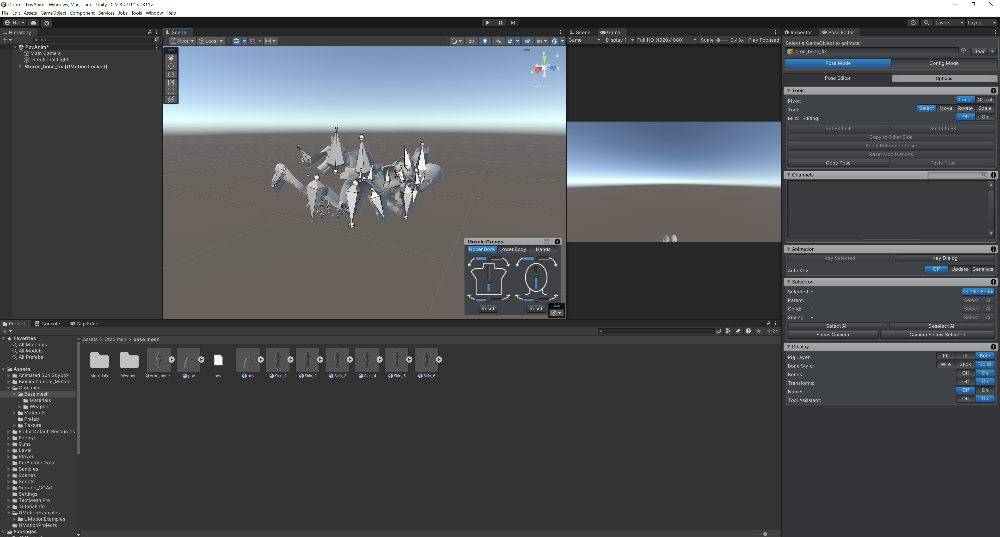

# Problems

## Problem 1: Die richtigen Assets finden

### Charakter
Ein Problem, das ich bei der Umsetzung meines Projekts hatte, war das Finden der richtigen Assets.
Ich hatte mir den Charakter ["Croc Men"](https://assetstore.unity.com/packages/3d/characters/humanoids/fantasy/croc-men-186131) vom Unity Asset Store heruntergeladen, der mir sehr gut gefallen hat. Das Problem war jedoch, dass dieser Charakter sehr fein granulare Mesh-Bone Beziehungen hatte was von Vorteil ist, wenn man viele unterschiedliche Animationen und spezielle Anpassungen wie andere Klamotten machen möchte, aber für mein Projekt war das zu viel. Daher waren meine ersten Versuche diesen Charakter mittels Blender anzupassen und mit einem Humanoiden Rig zu versehen nicht erfolgreich. Beim importieren in UMotion Pro ist es dann immer zu Problemen gekommen, weshelb ich mich dazu entschieden habe einen anderen Charakter zu verwenden.

### Waffe
Beim suchen nach einem guten Waffen Asset bin ich auf das exzellente [Sci-fi SCAR-L](https://assetstore.unity.com/packages/3d/props/weapons/fps-assault-rifle-sci-fi-weapon-edition-235010) Asset gestoßen. Das Problem war jedoch, dass dieses nur die High-Definition Render Pipeline (HDRP) unterstützt.
Aus diesem Grund habe ich mich dazu entschieden mein Projekt auf die HDRP umzustellen und bin im gleichen Zuge auch auf Unity 6 umgestiegen.

### Spinnen Asset

Das [Spinnen Asset](https://assetstore.unity.com/packages/3d/characters/animals/insects/spider-green-11869) ist sehr alt und daher nicht direkt nutzbar gewesen. Es musste erst von der Legacy Variante umgewandelt werden, wofür ich das FBX Exporter Package aus dem Unity Registry verwendet habe. Anschließend musste das Asset noch geriggt werden, was ich mit Blender gemacht habe. Danach war es bereit für die Animationen.

## Problem 2: Animationen erstellen

### Charakter Pivot Point
Ursprünglich hatte ich geplant den Charakter in der vertikalen Sicht mittels des rotierens der Spine Bones rotieren. Dies war jedoch nicht möglich, da Unity dies nicht auf einem Generic Rig Animierten Objekt unterstützt. Daher musste ich den Pivot Point des Charakters versetzen, um den Charakter in der First Person Ansicht rotieren zu können. Das Problem war jedoch, dass alle Animationen neu gemacht werden mussten, da die Animationen in UMotion Pro auf den alten Pivot Point berechnet waren und dies nicht geändert werden konnte. Zudem ist es nur sehr umständlich / nicht möglich Animationen, welche in UMotion Pro erstellt und exportiert wurden, wieder in UMotion Pro zu importieren.
